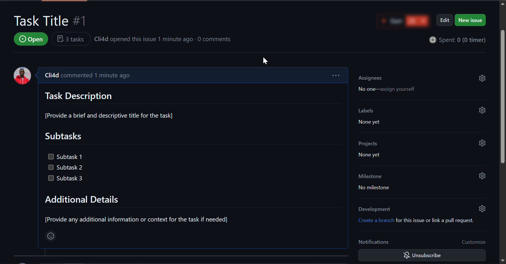
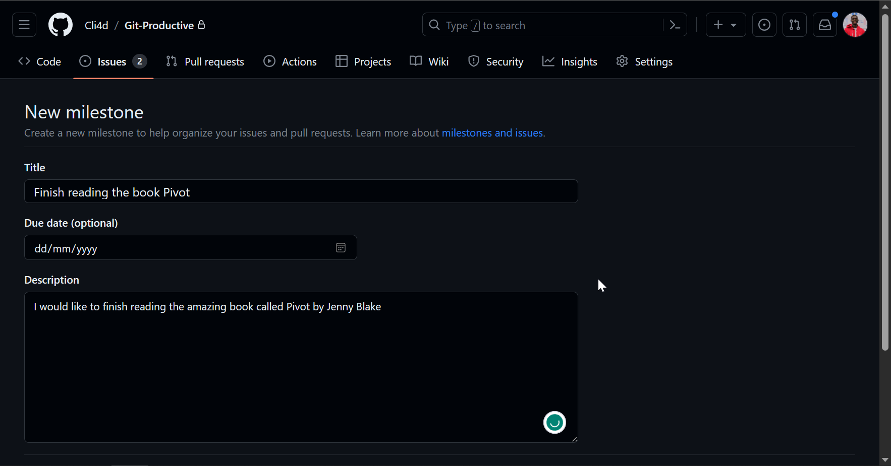

# Git-Productive With GitHub

This is a template repo for showcasing the use of GitHub's project management tools (Projects, Issues, and Milestones) as a productivity tool.
This readme file explains a little bit about this system.

## Table of contents

- [Git-Productive With GitHub](#git-productive-with-github)
  - [Table of contents](#table-of-contents)
  - [Introduction](#introduction)
  - [GitHub Issues](#github-issues)
    - [Good Issue management](#good-issue-management)
  - [GitHub Projects](#github-projects)
    - [Views and layouts](#views-and-layouts)
    - [Iterations and Workflows](#iterations-and-workflows)
  - [How to use this repository/system](#how-to-use-this-repositorysystem)
    - [Creating task items](#creating-task-items)
    - [Utilizing assignees, labels, and milestones](#utilizing-assignees-labels-and-milestones)
      - [Creating labels](#creating-labels)
      - [Assignees](#assignees)
      - [Milestones](#milestones)
    - [Projects](#projects)
  - [Other Resources](#other-resources)
  
## Introduction

This repo was created to provide more direction in setting up a productivity system using GitHub's project management tools.

It is a follow-up to the article published on the same. You can read the [article]() to understand more about the system, why I chose it, and why you should try it.

Most of the content on this Readme will be beginner oriented. It aims to share more about issues, milestones, and projects with a guide on how to set up each of them. 

If you are familiar with these tools, you can go ahead and utilize this template repo and tinker with those features to set up your productive system.

## GitHub Issues

To best understand how to maneuver around issues, let's first understand everything about them
Now GitHub issues were the individual task items and they can be easily created in any GitHub repository like this one

It contains 2 main parts:

1. **Title**  
   The title is usually clear and concise. And for our case, it would provide a clear picture of the
2. **Body**  
   This is where the details go. The content here allows the use of [markdown syntax](https://www.markdownguide.org/getting-started/) which is just a special way of formatting texts in plain text documents.
   However, those not familiar with markdown can use the options provided by GitHub’s User Interface.  

### Good Issue management

Several features aim to help you manage your issues. They include:

1. Task lists
   
   Task lists can be added to issues to break them down into smaller action items. This makes it easier to understand what to do. It also helps utilize the tasks done section of the issue hence knowing the progress in the issue.
    <!--Add a screenshot of the tasks done section  -->
2. Assignees
   
   This feature enables you to be able to assign issues to people on your team or even yourself. It is a great tool for delegation of duties and tasks.
   <!-- Add a screenshot of assignees -->
4. Labels
   
   Labels are useful in grouping and organizing items. Every repository has its own set of labels for the issues opened there. There are default labels available but you can override that as explained in the [label section of this ReadMe file](#). An issue can have multiple labels.
   <!-- Screenshot of labels -->

5. Milestones
   Milestones are used to track the progress of a collection of issues. It is used as an identifier of progress.
   <!-- Screenshot of milestones -->
6. Templates and Forms
   
   Issue templates and forms are a simpler way to gather accurate information about an issue by enforcing a structure. This structure helps guide on what information is needed. 

   <!-- Add a screenshot of issues and forms -->

   Setting up issue templates is enough for using this system. It gives you a format for all your task items. Issue forms are more technical in setting up. You can check the docs to learn more about setting up [issue templates](https://docs.github.com/en/communities/using-templates-to-encourage-useful-issues-and-pull-requests/configuring-issue-templates-for-your-repository) and [issue forms](https://docs.github.com/en/communities/using-templates-to-encourage-useful-issues-and-pull-requests/configuring-issue-templates-for-your-repository#creating-issue-forms)

## GitHub Projects

GitHub Projects helps keep track of issues using a higher level view of your issues and their lifecycle through a certain period

### Views and layouts

Views help you see certain aspects of your project. There are 3 main views available

- Kanban View
- Board view
- Roadmap view

<!-- Add a screenshot of the views -->

Depending on your preference you select a view that best suits your situation. You can also toggle between the different views if you want.

### Iterations and Workflows

Iterations exist in GitHub projects to aid teams that use certain workflow methodologies like SCRUM, AGILE, etc. Iterations are part of an issue's status and are used to break down an issue into iterations

Workflows aim to make your work easier. They try to automate tasks that you would have to repeatedly do. There are default workflows that you can toggle on and off. You can find them in the workflows tab of your GitHub Project

<!-- Add a screenshot of the projects tab -->

## How to use this repository/system

To be able to utilize these features and this repository you need to:

1. Have a GitHub account. If you don't have one you can [check this guide](https://docs.github.com/en/get-started/onboarding/getting-started-with-your-github-account#1-creating-an-accounnt).
2. Sign in to your GitHub account to utilize the template repository feature

### Creating task items

1. First of all, to easily use this repository, you can duplicate it (since it is a template). This will create a copy of this repository in your GitHub profile. Just click the '*use this template*' button and select '*create a new repository*'. Then enter a name for your repository and set it either public or private 

<!-- Screenshot of repo template creation -->

*Creating a repository from the template*

1. Create your issues.
   
   Remember in our case these, issues act as your task items. The things you need to do. To create a GitHub issue:

   - Navigate to the Issues tab of your repository. It shows existing tasks, their labels, assignees, and other details. But since this is a new repository there will be no issues. So let's create one
<!-- Add Screenshot of locating issues tab -->

*Issues tab for creating issues*

   - Click on *new issue* and then enter the details of your issue/task. I had an issue template setup for the repo called task item. Click on *get started* and then modify the template with your task's details. Issue templates give you an easier way to define a structure for your issues, save time in creating them and get accurate information. You can learn more about issue templates on [GitHub's official docs](https://docs.github.com/en/communities/using-templates-to-encourage-useful-issues-and-pull-requests/configuring-issue-templates-for-your-repository)
  
   *Issue template page*

   - Click get started and enter the details of your issue. The title and body contain task items. The editor uses [markdown format](https://www.markdownguide.org/getting-started/). If you are not familiar with markdown, you can use GitHub's editor options at the top of the issue body section
  
   *Issue creation tab*

   - After entering all the details, click on *submit new issue*, and **voila!** :smiley: You just created your first issue. However hold on before you hit that create issue button, we need to add a few details to our issues first.
   
   *View of a created issue*

<!-- Add a screenshot without a template and with a template -->

### Utilizing assignees, labels, and milestones

Before creating an issue, it is important to add labels, assign issues and even select the milestones the issue is part of

#### Creating labels

Now let's learn how we can create labels first.

- Navigating to the issue tab on the repo, and selecting labels will open up the labels.

*Issues tab*

- Every repository usually has GitHub's default labels. You can, however, create new labels, edit or even delete existing ones. Add a new label, delete, or edit existing ones.

*Iabel tab of the repository*

- You can select the labels associated with your issue when creating an issue. One issue can have multiple labels.

*Adding labels while creating an issue/task*

#### Assignees

You can also add assignees while creating an issue. It is a sense of responsibility. It works best when you are collaborating with others in an accountability system. You can also assign issues to yourself.

*Assignees selection while creating an issue*

#### Milestones

Milestones are useful in grouping tasks that work towards a common goal. It also helps you track the progress of the milestone. To create milestones:

- Go to the issues tab and select milestones. Then create the milestone

*Select Milestone from the issues tab*

- When creating a milestone, you just select a title, description, and a due date for the milestone (which is optional)

*Enter details of the milestone to create it*

- You can then select the milestone to individual issues associated with it either while creating it or after creating the issue

*Selecting a milestone for your issue*

Now whenever you close the issue, your milestone will track the progress, showing issues open and those closed. 

*Milestone with 50% progress*

### Projects
This is the tool that brings everything together. It helps one make sense of everything.

You can create a project for each repository you have and then associate your issues with the project. To create a GitHub project:

- Navigate to the projects tab on your repository

*Projects tab location on your repository*

- You can click on *link a project* and then create a new project if you have none but if you have an existing one you'd like to use, link to it. 

*Create or link a GitHub project*

- Select a view for your project. There are also templates available for use in certain project scenarios.

*Selecting a view for your project*

- After creating you can select the pencil icon next to the project name to change the name of your project and also add a description

*Editing details of your project*

- Now you can go to your issues and add the project to them. This will have them show up on your project view

*Connecting an issue with a GitHub Project*

- The issue will be visible on your project view. Each view has different features and customization options. For example, the board feature allows you to drag across issues to set their status. You can also customize your status for all views etc. 

*Projct's view after connecting it with an issue*

Now there are a lot of things you can do with GitHub Projects and set it up. I will only talk about **workflows** and then share resources where you can learn more about Projects. 

Workflows make it easy to work with GitHub Projects as they help do repetitive tasks through automation. To set up some workflows, navigate to workflows from your project

*Opening workflows from your GitHub project*

- In the workflows tab, you can see all the available workflows and their status. Whether on or off.
 
*Workflow tab showing the workflows and their status*

- You can edit a workflow to turn it on or off and change the name. 
- Not all workflows will apply to you. Only turn on those that are useful to you. For this system, I found 3 workflows useful. 
  - One to set item status to todo whenever it is added to the project.
  - Workflow to status for item done after the issue is closed
  - Workflow to auto-add issues from my repository to this project.

You can learn more about GitHub projects from the [official docs](https://docs.github.com/en/issues/planning-and-tracking-with-projects)

## Other Resources

1. Course by Teresa Luz Miller on [GitHub Issues and Projects for teams](https://www.linkedin.com/learning/github-issues-and-projects-for-teams/collaboration-at-its-finest-with-github-issues-and-projects) on LinkedIn Learning
2. GitHub official Docs on [Projects](https://docs.github.com/en/issues/planning-and-tracking-with-projects)
3. My article on using GitHub's Project management tools for ultimate productivity
4. Learn more about using labels and milestones from the [official docs](https://docs.github.com/en/issues/using-labels-and-milestones-to-track-work)
5. How do task lists fit in with the issues you create? Read about it from the [docs here](https://docs.github.com/en/get-started/writing-on-github/working-with-advanced-formatting/about-task-lists)
6. Everything about Issues in the [official docs](https://docs.github.com/en/rest/issues?apiVersion=2022-11-28)

[Back to top](#github-project-template-repo)